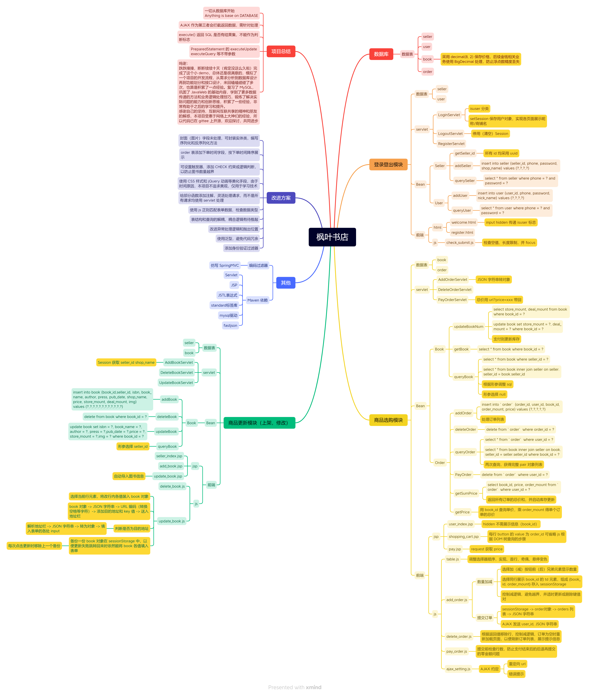

# bookshop

#### 介绍
枫叶网上书店系统

#### 软件架构
JavaWeb 项目  
前端：HTML、JSP 组织页面，JS 处理样式和数据验证与传递，CSS 控制样式  
后端：Servlet 处理请求，JavaBean 提供方法和连接数据库，Filter 编码过滤器  

#### 安装教程
环境：
IntelliJ IDEA 2022.2.3 (Ultimate Edition)  
JDK 1.8.0_301  
Tomcat 9.0.65  
Maven 3.8.6  
1.  git 源码
2.  刷新 Maven
3.  运行 init_database.sql 建库建表，导入初始数据，若无 bookshop 数据库，请注释 `drop database bookshop;`
4.  配置 Tomcat 服务，添加 exploded 工件，设置启动页为 http://{ip}:{port}/{artifact_name}/html/welcome.html
5.  启动 Tomcat 服务

#### 流程介绍
顾客流程

登录系统

注册账号

图书总览，表格悬停变色，右侧可视化加减

结算，进入购物车，自动计算总价，右侧可视化删除

支付，计算总金额

退出登录，清空 Session  

商户流程

登录系统，展示店内书目，右侧可视化修改删除

修改，自动填充信息

删除，书目为零自动刷新页面，展示提示信息

上架图书，

#### 特技
1.  采用 表单，Ajax+JSON，url编解码，writer.print/write，setHeader，sendRedirect 等多种方式在前端之间、前后端之间传递数据
2.  灵活使用 Session sessionStorage 处理业务逻辑
3.  采用 UUID 适应现实项目要求
4.  灵活遍历 DOM 树，获取前端数据
5.  采用 decimal 处理金钱，避免浮点数精度问题